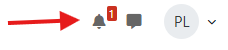
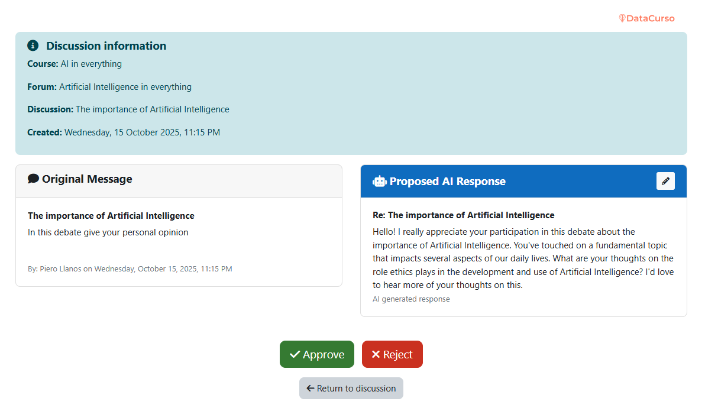
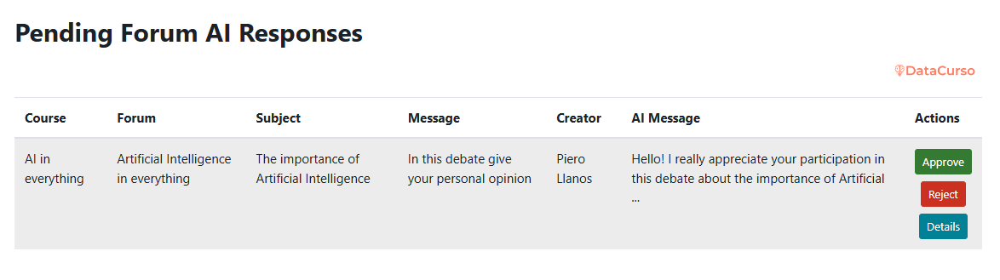
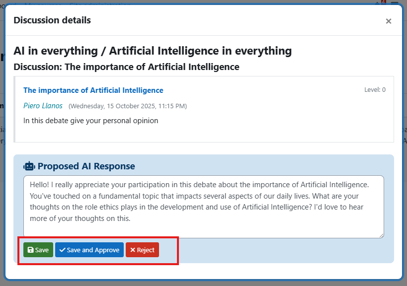
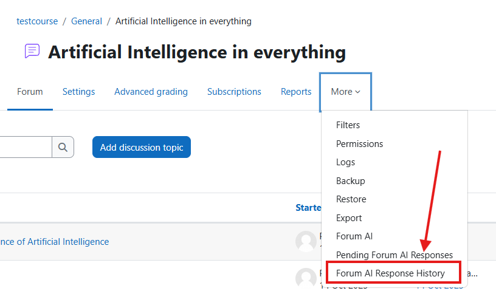

## FORUM AI

This plugin allows administrators and teachers to review comments generated by Artificial Intelligence on discussions created in any type of forum.

## Pre-requisites

1. Have at least PHP version 8.1 installed on the server.

2. Have Moodle version 4.1.14 or higher, up to version 4.5.

## Installation via uploaded ZIP file

1. Log in to your Moodle site as an administrator and go to Site `Administration > Plugins > Install Plugins`.
2. Upload the ZIP file with the plugin code. You'll only be prompted to add additional details if the plugin type isn't automatically detected.
3. Check the plugin validation report and complete the installation.

## Manual installation

The plugin can also be installed by placing the contents of this directory in

`{su/moodle/dirroot}/local/forum_ai`

Next, log in to your Moodle site as an administrator and go to Site `Administration > General > Notifications` to complete the installation.

Alternatively, you can run

```bash
php admin/cli/upgrade.php
```

to complete the installation from the command line.

## Create a forum in a course

1. We created a forum.

   

2. We put name and type of forum.

   

3. We go to the end and find the "Datacurso Forum AI" section, enable AI, enable response review, enter the user ID with which the message will appear, and add a prompt to give instructions to the artificial intelligence.

   

## Create forum discussions

1. We created our debate.

   

2. We put our subject and message.

   

3. When you create a discussion, a notification will be sent to the course creators, administrators, and instructors.

   

## IA Response Review - Notification

1. There are two ways to review the response generated by Artificial Intelligence, starting with the notification.

   

2. Entering the notification takes us to this view, where it shows us details about the forum and the generated message.

   

3. In this view we can edit the message generated by the AI.

   

4. When everything is reviewed we decide whether to approve or reject the response.

   

## IA Response Review - List

1. The second way to review the responses generated by the list is to go to the course and access reports.

   

2. We entered Pending AI Responses.

   

3. Here we will have a list of all the responses generated by the AI.

   

4. We can see details of the AI ​​response.

   

5. It will show us in a modal the forum thread and details of the AI ​​response.

   

6. Similarly we can edit the message and save.

   

7. Finally, you decide whether to approve or reject the message.

   

## AI Response History

1. Within reports we enter the history.

   

2. Here it shows us a table with all the approved/rejected responses.

   

3. We can see details. 

   

4. In the details it shows us the forum thread and the approved/rejected AI response.

   
