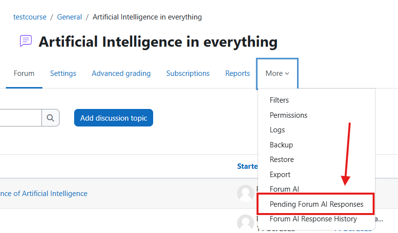

## FORUM AI

The Forum AI plugin integrates artificial intelligence into Moodle’s forum module, transforming discussion spaces into more interactive, dynamic, and efficient environments.

Its primary function is to analyze student contributions within forum discussions and generate AI-assisted responses that teachers and administrators can edit, approve, or publish directly.

This innovation helps educators save time, encourage meaningful participation, and ensure that students receive timely, pedagogically sound feedback, even in large or highly active courses.

## Pre-requisites

1. Moodle 4.5
2. Install the Moodle AI provider "DataCurso AI Provider". Download it for free from [https://moodle.org/plugins/aiprovider_datacurso/versions](https://moodle.org/plugins/aiprovider_datacurso/versions).
3. In the DataCurso AI Provider settings, configure a valid license key as documented at [https://docs.datacurso.com/index.php?title=Datacurso_AI_Provider#Getting_license_keys](https://docs.datacurso.com/index.php?title=Datacurso_AI_Provider#Getting_license_keys).

**IMPORTANT**: This plugin will not function unless the "DataCurso AI Provider" plugin is installed and licensed.

## Installation via uploaded ZIP file

1. Log in to your Moodle site as an administrator and go to Site `Administration > Plugins > Install Plugins`.
2. Upload the ZIP file with the plugin code. You'll only be prompted to add additional details if the plugin type isn't automatically detected.
3. Check the plugin validation report and complete the installation.

## Manual installation

The plugin can also be installed by placing the contents of this directory in

`{su/moodle/dirroot}/local/forum_ai`

Next, log in to your Moodle site as an administrator and go to Site `Administration > General > Notifications` to complete the installation.

Alternatively, you can run

```bash
php admin/cli/upgrade.php
```

to complete the installation from the command line.

## Create a forum in a course

Once installed, Forum AI integrates seamlessly into the standard forum creation process in Moodle.

1. Create a new forum
   
   Begin by adding a forum activity to your course as usual.

   

2. Set forum name and type

   Enter the forum title and select the type (e.g., Standard forum for general use, Q&A forum, etc.).

   

3. Enable AI features
   
   Scroll to the “Datacurso Forum AI” section. Here, you can:
   - Enable the AI integration for this forum.
   - Enable AI response review, which requires teacher approval before posting AI responses.
   - Give the AI ​​extra directions

   

   These settings allow teachers to fully control how AI interacts within each course discussion.

## Create forum discussions

After configuring the forum, you can start using Forum AI in real learning interactions.

1. Create a new discussion

   Teachers or students create a new discussion topic in the forum.

   

2. Add subject and message

   Enter a meaningful subject and initial post to start the discussion.

   

3. Automatic notifications

   When a new discussion is created, notifications are sent to teachers, administrators, and course managers, informing them that AI is ready to analyze and generate potential responses.
   
   

## IA Response Review - Notification

The Forum AI plugin allows teachers to review all AI-generated responses before they appear in the forum. This ensures control and quality in communication.

1. Review through notification

   The first method of reviewing AI-generated content is directly via the notification message.

   

2. Access response details

   By clicking the notification, you’ll access a detailed view showing the original forum post and the AI-generated suggestion.

   

3. Edit the AI message

   Teachers can edit the suggested message to adjust tone, depth, or accuracy before publication.

   

4. Approve or reject

   Once the message is reviewed, teachers can choose to approve (publish) or reject the AI’s response.

   

## IA Response Review - List

The second way to manage AI-generated responses is through the Pending AI Responses report within the course.

1. Access reports
   
   From the course administration panel, navigate to Reports.

   

2. Enter Pending AI Responses

   Select Pending AI Responses to view all AI messages awaiting review.

   

3. View pending items

   A list of all AI-generated replies will appear, showing their current status and associated forum threads.

   

4. See detailed response

   Click the Details button to open the AI-generated message and related discussion.

   

5. View modal with details

   A modal window will display the forum thread context along with the AI’s proposed reply.

   

6. Edit and save

   The teacher can edit the AI-generated message and either save it as a draft or approve it for publication.

   

7. Approve or reject

    Finally, decide whether to approve the AI response (publishing it) or reject it if it doesn’t meet the desired tone or content quality.

   

## AI Response History

All past AI responses — whether approved or rejected — are logged for traceability and reflection.

1. Access the history

   Within the reports section, go to AI Response History.

   

2. View the complete table

   A table displays every AI response, including date, author, approval status, and linked discussion.

   

3. View individual details

   Click Details to inspect each AI response in context.

   

4. Thread and response details

   The detailed view displays both the original forum thread and the corresponding AI reply (approved or rejected).

   
